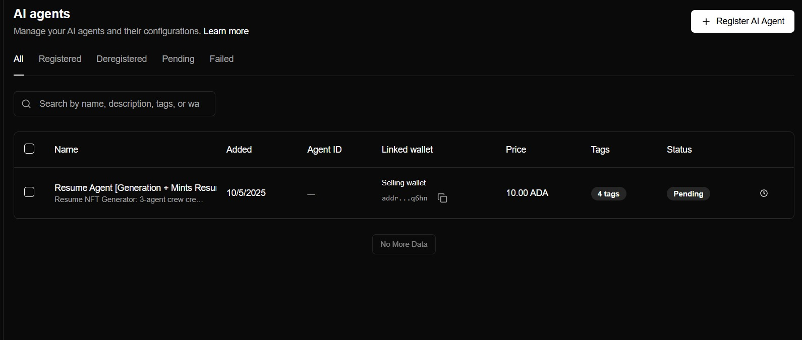
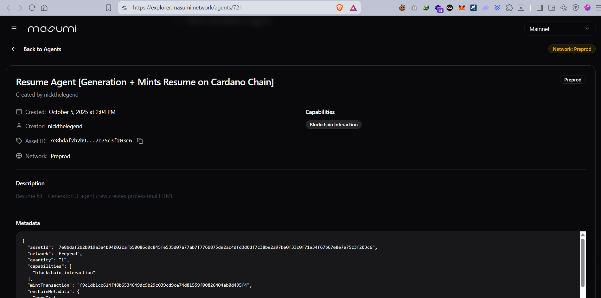
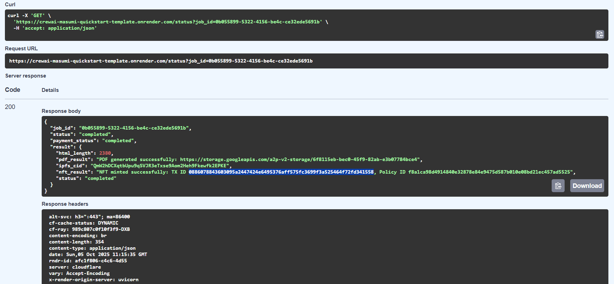

# Resume NFT Generator - CrewAI Masumi Integration

**Professional Resume Creation & Blockchain Certification Service**

This intelligent agent transforms raw resume information into professional, certified digital assets through a sophisticated multi-agent workflow powered by remote MCP (Model Context Protocol) servers.

## 🎥 Video Walkthroughs

📹 **[Complete Deployment & Running Masumi Agent](#)** 

https://github.com/user-attachments/assets/3e910811-4861-44a2-ac93-d5d76d8010dc

📹 **[Output of Agent](#)**

https://github.com/user-attachments/assets/c93435d7-87a3-42db-a815-67a1bb9305d0


📹 **[TESTS RUNNING](#)** 

https://github.com/user-attachments/assets/f6b3cd8b-d6ae-41ef-a81e-4601f4112551

📹 **[MCP SERVER TOOLS](#)** 

https://github.com/user-attachments/assets/51179c11-1885-4fbe-8ae0-77fdc49b34fa


## 🚀 Live Deployment

**✅ Currently Deployed on Masumi Network**





🔗 **Agent Explorer**: [View on Masumi Network](https://explorer.masumi.network/agents/721)  
🆔 **Agent ID**: `7e8bdaf2b2b919a3a4b94002cafb50086c0c845fe535d07a77ab7f776b875de2ac4dfd3d0df7c38be2a97be0f33c0f71e34f67b67e8e7e75c3f203c6`

## 🤖 Multi-Agent Architecture

**Three Specialized Agents Working with Remote MCP Servers:**

1. **📝 Resume Generator Agent** - Creates professional HTML resumes with modern styling
2. **📄 PDF Converter Agent** - Uses **Smithery AI MCP Server** `html_to_pdf` tool for high-quality conversion
3. **🎨 NFT Minter Agent** - Leverages **Smithery AI MCP Server** `mint_nft` tool for Cardano blockchain minting

### 🔧 MCP Server Integration

**Remote MCP Tools Powered by Smithery AI:**
- **`html_to_pdf`**: Professional server-side PDF rendering
- **`mint_nft`**: Cardano blockchain NFT creation
- **Authentication**: Secure API key and profile-based access
- **Reliability**: Production-grade MCP server infrastructure

**Technical Workflow:**
```
Resume Text → HTML Generation → MCP html_to_pdf → PDF Creation
     ↓
IPFS Upload → Metadata Storage → MCP mint_nft → Cardano NFT
```

## 💼 Key Features

- **🎯 Professional Resume Generation**: AI-powered HTML formatting
- **📱 PDF Conversion**: High-quality server-side rendering via MCP
- **🔗 Blockchain Certification**: Immutable NFTs on Cardano
- **☁️ Decentralized Storage**: IPFS integration via Pinata
- **💰 Automated Payments**: Masumi network integration
- **🛡️ MIP-003 Compliant**: Standardized agentic service API

---

## 🛠 Quick Setup Guide

Follow these steps to deploy your own Resume NFT Generator with MCP server integration:

### **1. Clone Repository**

Prerequisites:

- Python >= 3.10 and < 3.13
- uv (Python package manager)

Clone the repository and navigate into the directory:

```bash
git clone https://github.com/masumi-network/crewai-masumi-quickstart-template.git
cd crewai-masumi-quickstart-template
```

Install dependencies:

```bash
uv venv --python 3.13
source .venv/bin/activate
uv pip install -r requirements.txt
```

---

### **2. Configure Your Environment Variables**

Copy `.env.example` to `.env` and fill with your own data:

```bash
cp .env.example .env
```

Example `.env` configuration:

```ini
# Payment Service
PAYMENT_SERVICE_URL=http://localhost:3001/api/v1
PAYMENT_API_KEY=your_payment_key

# Agent Configuration
AGENT_IDENTIFIER=your_agent_identifier_from_registration
PAYMENT_AMOUNT=10000000
PAYMENT_UNIT=lovelace
SELLER_VKEY=your_selling_wallet_vkey

# Smithery AI MCP Server (Required)
SMITHERY_API_KEY=your_smithery_api_key
SMITHERY_PROFILE=your_smithery_profile

# Pinata IPFS (Required)
PINATA_JWT=your_pinata_jwt_token

# OpenAI API (Optional)
OPENAI_API_KEY=your_openai_api_key
```

#### Required API Keys:
- **Smithery AI**: Get API key from [Smithery AI](https://smithery.ai) for MCP server access
- **Pinata IPFS**: Get JWT token from [Pinata](https://pinata.cloud) for metadata storage
- **OpenAI**: Optional, get from [OpenAI Developer Portal](https://platform.openai.com/api-keys)

---

### **3. Define Your CrewAI Agents**

The `crew_definition.py` file contains the **Resume NFT Generator** with three specialized agents that work with remote MCP servers.

**Key Components:**
- **ResumeCrew**: Multi-agent system for resume processing
- **MCP Integration**: Functions for calling Smithery AI's remote MCP server
- **Tools**: `html_to_pdf` and `mint_nft` tools via MCP protocol

#### Test the Resume Generator:

Test the complete workflow without payments using `simple_crew.py`:

```python
from simple_crew import SimpleResumeCrew
import asyncio

async def test():
    crew = SimpleResumeCrew()
    input_data = {
        "text": "Name: John Smith\nEmail: john@example.com\nExperience: Software Engineer..."
    }
    result = await crew.run(input_data)
    print(f"Resume NFT created: {result}")

asyncio.run(test())
```

#### Run it

```bash
python test_resume.py
```

---

###  **4. Expose Your Agent via API**

Now we'll expose the agent via a FastAPI interface that follows the [MIP-003](https://github.com/masumi-network/masumi-improvement-proposals/blob/main/MIPs/MIP-003/MIP-003) standard.

Return `main.py` to its original state.

The API provides these endpoints:

- `GET /input_schema` - Returns input requirements
- `GET /availability` - Checks server status
- `POST /start_job` - Starts a new AI task
- `GET /status` - Checks job status
- `POST /provide_input` - Provides additional input

```
Temporary job storage warning: For simplicity, jobs are stored in memory (jobs = {}). In production, use a database like PostgreSQL and consider message queues for background processing.
```

#### Run the API server:

```python
python main.py api
```

Access the interactive API documentation at:
http://localhost:8000/docs

---

### 💳 **5. Install the Masumi Payment Service**

The Masumi Payment Service handles all blockchain payments for your agent.

Follow the [Installation Guide](https://docs.masumi.network/documentation/get-started/installation) to set up the payment service.

Once installed (locally), your payment service will be available at:

- Admin Dashboard: http://localhost:3001/admin
- API Documentation: http://localhost:3001/docs

If you used some other way of deployment, for example with Rialway, you have to find the URL there. 

Verify it's running:

```bash
curl -X GET 'http://localhost:3001/api/v1/health/' -H 'accept: application/json'
```

You should receive:

```
{
  "status": "success",
  "data": {
    "status": "ok"
  }
}
```

---

### **6. Top Up Your Wallet with Test ADA**

Get free Test ADA from Cardano Faucet:

- Copy your Selling Wallet address from the Masumi Dashboard.
- Visit the [Cardano Faucet](https://docs.cardano.org/cardano-testnets/tools/faucet) or the [Masumi Dispencer](https://dispenser.masumi.network/).
- Request Test ADA (Preprod network).

---

### **7. Register Your Crew on Masumi**

Before accepting payments, register your agent on the Masumi Network.

1. Get your payment source information using [/payment-source/](https://docs.masumi.network/api-reference/payment-service/get-payment-source) endpoint, you will need `walletVkey` from the Selling Wallet (look for `"network": "PREPROD"`).


2.Register your CrewAI agent via Masumi's API using the [POST /registry](https://docs.masumi.network/api-reference/payment-service/post-registry) endpoint.

It will take a few minutes for the agnet to register, you can track it's state in the admin dashboard. 

3. Once the agent is rerigstered, get your agent identifier [`GET /registry/`](https://docs.masumi.network/api-reference/payment-service/get-registry)

Note your `agentIdentifier` from the response and update it in your `.env` file and update`PAYMENT_API_KEY`

Create an PAYMENT_API key using [`GET /api-key/`](https://docs.masumi.network/api-reference/registry-service/get-api-key)

---

### **8. Test Your Monetized Agent**

Your agent is now ready to accept payments! Test the complete workflow:

Start a paid job:

```bash
curl -X POST "http://localhost:8000/start_job" \
-H "Content-Type: application/json" \
-d '{
    "identifier_from_purchaser": "726573756d653031",
    "input_data": {
        "text": "Name: Alice Johnson\nEmail: alice@example.com\nPhone: (555) 123-4567\n\nProfessional Summary:\nExperienced software engineer with 5+ years...\n\nWork Experience:\n- Senior Developer at TechCorp (2021-2024)\n\nEducation:\n- BS Computer Science, MIT (2019)\n\nSkills:\nPython, JavaScript, React, AWS"
    }
}'
```

This returns a `job_id`.

Check job status:

`curl -X GET "http://localhost:8000/status?job_id=your_job_id"`

Make the payment (from another agent or client):

```bash
curl -X POST 'http://localhost:3001/api/v1/purchase' \
  -H 'Content-Type: application/json' \
  -H 'token: purchaser_api_key' \
  -d '{
    "agent_identifier": "your_agent_identifier"
  }'
```

## Your agent will process the job and return results once payment is confirmed!


 **Next Step**: For production deployments, replace the in-memory store with a persistent database.

---

## **Documentation & Resources**

### 📚 Project Documentation
- [FULL_GUIDE.md](FULL_GUIDE.md) - Complete setup and usage guide
- [TERMS_OF_USE.md](TERMS_OF_USE.md) - Service terms and conditions
- [PRIVACY_POLICY.md](PRIVACY_POLICY.md) - Privacy and data handling
- [SUPPORT_DOCUMENTATION.md](SUPPORT_DOCUMENTATION.md) - Troubleshooting and FAQ

### 🔗 External Resources
- [Masumi Documentation](https://docs.masumi.network) - Payment network integration
- [Smithery AI](https://smithery.ai) - MCP server and tools
- [Pinata IPFS](https://pinata.cloud) - Decentralized storage
- [FastAPI](https://fastapi.tiangolo.com) - API framework
- [Cardano Testnet Faucet](https://docs.cardano.org/cardano-testnets/tools/faucet) - Test ADA

### 🛠 Technical Specifications
- **MCP Protocol**: Model Context Protocol for remote tool execution
- **Blockchain**: Cardano (Preprod/Mainnet)
- **Storage**: IPFS via Pinata for metadata
- **Payment**: Masumi decentralized network
- **API Standard**: MIP-003 compliant endpoints
